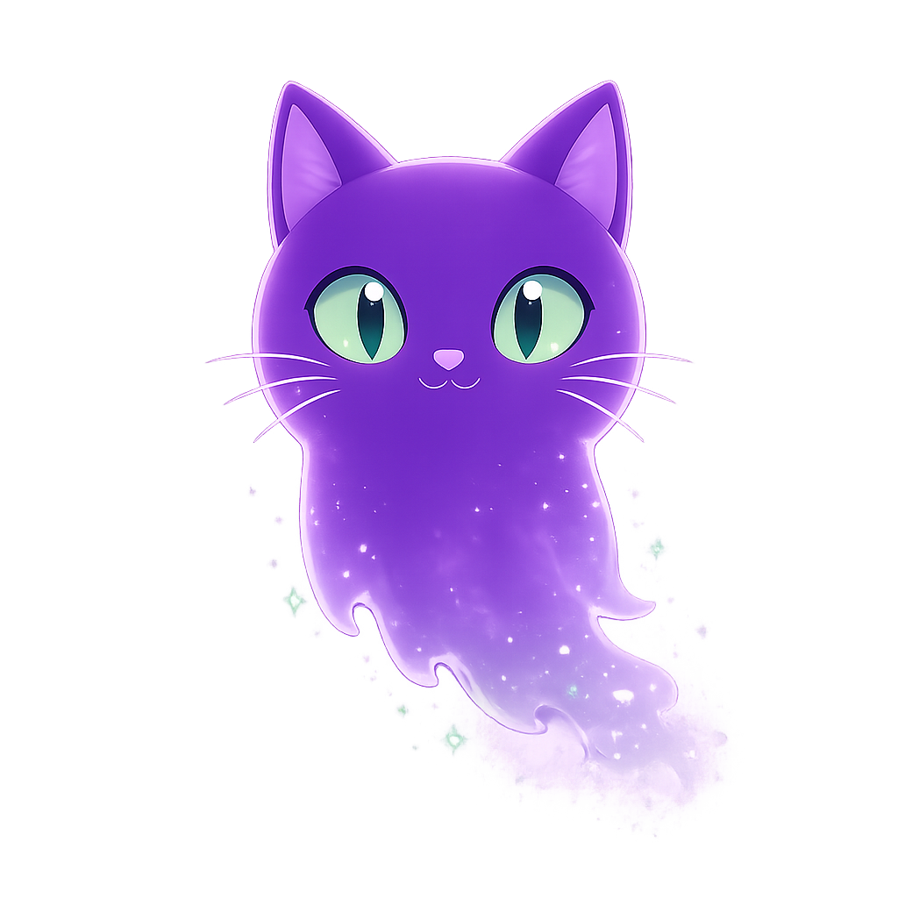

<p align="center">
  
</p>

<h1 align="center">VanishWhisper</h1>

<p align="center">
  End-to-end encrypted ephemeral 1-on-1 chat — anonymous, no backend, runs on Firebase free tier.
</p>

<p align="center">
  <a href="https://vanishwhisper.web.app">🌐 Live demo</a>
</p>

---

VanishWhisper is a single-page web app for short-lived secure conversations. Each message vanishes after the recipient reads it. Identity is just a Firebase-issued anonymous UID plus a per-browser RSA keypair — no email, no signup, no cross-device sync.

## Features

- **End-to-end encryption** — Web Crypto API throughout (RSA-OAEP 2048 + AES-GCM 256). The server only ever sees ciphertext.
- **Anonymous identity** — Firebase Anonymous Auth. UID + public key on the server, private key never leaves the browser.
- **Read-triggered vanish** — messages auto-delete after the recipient reads them; countdown duration is per-recipient configurable (5 min – 24 hr).
- **Sender unsend** — pull a message back at any time.
- **Mutual session delete** — both parties must agree before a session and its history are wiped.
- **Encrypted image attachments** — client-side compressed (≤ 750 KB), AES-GCM encrypted, embedded inline in Firestore (no Storage required).
- **Reactions and stickers** — six emoji reactions plus nine bundled Whisp ghost-cat stickers.
- **Pin / Archive / Unread** — local-only home-list organization with a discreet unread indicator.
- **Invite links** — one-tap share via the iOS/Android native share sheet, falls back to clipboard on desktop.

## Threat model

Deliberate decisions, in priority order. Treat these as design invariants — adding any of the rejected items isn't an oversight, it's a non-goal.

1. **No identity provider.** No Google OAuth, no email, no profile pictures. The server can't tie chat traffic to a real-world identity. Federated sign-in, email recovery, and server-side display names are explicitly out of scope.
2. **No cross-device sync.** Private keys live in the originating browser's IndexedDB and stay there. There is no "log in on another device" flow, no key backup. Clearing site data is the intended "burn" gesture.
3. **No custom backend.** All client logic runs in-browser; Firestore security rules are the only enforcement layer. Cloud Functions are deliberately not used — if a flow can't be expressed in rules, the design gets revisited rather than reaching for server code.
4. **Local-only labels.** Display names you give a session or the other party live exclusively in your browser's IndexedDB. The server sees `Yq4nZ…wLm8`, never "Alice".
5. **Vanish is a UX commitment, not a cryptographic one.** Once `ReadAt` fires, both clients independently honor the countdown and the rules pin who can write `DeletedAt`. The server can't prevent a recipient screenshotting before expiry — same constraint every chat app shares.

## Architecture

```
[Browser] ──── (anonymous JWT) ────────────────► [Firebase Auth]
    │
    │ (firestore SDK, gated by security rules)
    ▼
[Cloud Firestore]
    Users/{uid}            — RSA public key + DeletedInMinutes
    ChatSessions/{id}      — participants + RSA-wrapped session AES key
    ChatMessages/{id}      — { Context: AES-GCM(text) | Attachment | Sticker, … }
```

- **First sign-in** generates an RSA-OAEP 2048 keypair via Web Crypto. Private key is `non-extractable` and persisted in IndexedDB; public key is published as SPKI on `Users/{uid}`.
- **Session creation** generates a per-session AES-GCM 256 key, RSA-wraps it for both participants (`WrappedKey1` for `Participant1`, `WrappedKey2` for `Participant2`), writes the wrapped pair plus participant UIDs.
- **Session open** decrypts your wrapped key with your RSA private key, recovering the session AES key for the rest of the chat.
- **Message send** encrypts text/image bytes with the session AES key (fresh 12-byte IV per message), writes ciphertext to `ChatMessages` and bumps session metadata in a single batched commit.
- **Message read** decrypts in-browser. The recipient client writes `ReadAt = serverTimestamp()` exactly once, starting the recipient-controlled vanish countdown.
- Everything realtime flows through `onSnapshot` — no polling, no Pub/Sub, no Cloud Functions.

The Firestore rules in [`firestore.rules`](firestore.rules) are the actual security boundary. Each `ChatMessages.update` shape is gated separately (recipient-only `ReadAt`, recipient-only auto-vanish, sender-only unsend, either-party reactions), with timestamps pinned to `request.time` so neither side can replay an old timestamp to trigger an instant vanish.

## Tech stack

- **Frontend:** Vue 3 + Vue Router 4 + Vite + TypeScript
- **Backend:** None — Firestore is the only server, security rules are the only enforcement
- **Realtime:** Firestore `onSnapshot`
- **Auth:** Firebase Anonymous Auth
- **Crypto:** Web Crypto API (RSA-OAEP 2048 / SHA-256 and AES-GCM 256)
- **Storage:** Firestore for everything (encrypted image bytes embed inline up to ~750 KB)
- **Hosting:** Firebase Hosting (Spark / free tier)
- **Tooling:** ESLint 9 (flat config), Prettier, Vitest

## Getting started

```bash
git clone https://github.com/redtear1115/vanishwhisper.git
cd vanishwhisper
npm install

# Vite dev server with hot reload
npm run dev

# Type-check + production build to dist/
npm run build

# Vitest one-shot
npm test -- --run

# ESLint + Prettier
npm run lint
npm run format
```

## Deploy

The repo is wired to Firebase project `vanishwhisper`. To deploy your own instance:

1. Create a Firebase project (Spark / free tier is enough).
2. Enable **Anonymous Auth** in the Firebase console.
3. Enable **Cloud Firestore** in production mode.
4. Update `.firebaserc` to point at your project ID.
5. Replace the inlined web app config in `src/firebase.ts` with your project's config (these values are public — they ship in the client bundle anyway).
6. Build and deploy:

```bash
npm run build
firebase deploy
```

The included `firestore.rules` and `firestore.indexes.json` are mandatory — they enforce every guarantee in the threat model. Don't deploy hosting without them.

## Project structure

```
src/
  views/                   # page-level components (Vue Router targets)
    HomeView.vue             # session list — pinned / default / archived sections
    CreateSessionView.vue    # invite flow + share link
    JoinView.vue             # /join/:uid landing for invite recipients
    ChatSessionView.vue      # main chat experience
    ProfileView.vue          # UID, fingerprint, vanish-window settings
  components/
    AppLogo.vue              # Whisp mascot wrapper (topbars + splash)
  assets/
    whisp-mascot.png         # painted brand mark
    stickers/                # 9 bundled chat stickers
  styles/theme.css           # design tokens (--vw-* CSS variables)
  identity.ts                # anonymous auth + RSA keypair lifecycle
  sessions.ts                # session create / list / open / mutual-delete
  messages.ts                # send (text / image / sticker), subscribe, react, unsend
  users.ts                   # DeletedInMinutes read / write / subscribe
  labels.ts                  # local per-session prefs (name, state, lastSeenAt)
  stickers.ts                # bundled sticker registry
  idb.ts                     # shared IndexedDB connection + retry wrapper
  codec.ts                   # base64 helpers
  firebase.ts                # Firebase initialization
  router.ts                  # Vue Router config

firestore.rules              # security rules — the actual enforcement layer
firestore.indexes.json       # composite indexes
```

## Roadmap

**Done**

- Phase 1 — anonymous auth + RSA, invitation + per-session AES wrapping, realtime session list, E2E text chat, read-triggered vanish.
- Phase 2 — sender unsend, emoji reactions, image attachments, lightbox, stickers, per-user labels, mutual session delete, profile page, invite links + native share, pin / archive / unread, single session per pair.

**Deferred** (not pulled forward without a design discussion)

- Pin individual messages, password-locked chats, message replies / threads.
- Skin / sticker pack management.
- Subscription tier with paid skins / sticker packs.
- Voice / phone call.

## License

No license file is committed yet — the repo is "all rights reserved" by default. If you intend to publish for reuse, add an [MIT](https://choosealicense.com/licenses/mit/) (permissive) or [AGPL-3.0](https://choosealicense.com/licenses/agpl-3.0/) (copyleft) `LICENSE` file before opening the project up.
